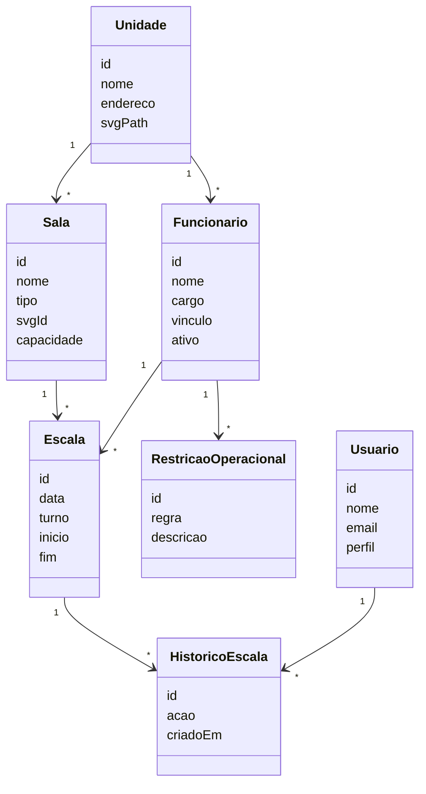

Arquitetura MVP — Sistema Visual de Escala para Unidade de Saúde

Visão Geral

O sistema terá como objetivo substituir controles manuais realizados em Google Planilhas por uma interface visual interativa baseada no croqui real da unidade de saúde.

A gerente visualizará a planta simplificada da unidade e poderá distribuir profissionais através de drag and drop diretamente nas salas/setores.

O sistema será inicialmente focado em:

- escala diária;
- operação via navegador web;
- uma unidade piloto;
- controle manual da distribuição;
- histórico simples de alterações.

A arquitetura será preparada desde o início para:

- múltiplas unidades;
- replicação de escala;
- aplicação mobile futura;
- regras de validação mais sofisticadas.

---

Objetivos do MVP

Funcionalidades principais

Gestão visual da escala

A gerente poderá:

- selecionar a data;
- visualizar o croqui da unidade;
- arrastar profissionais para salas;
- remover profissionais;
- visualizar ocupação dos setores.

Consulta reversa

Será possível:

- selecionar um funcionário;
- visualizar onde ele está escalado;
- consultar histórico simples.

Regras básicas

O sistema deverá validar:

- profissionais permitidos por setor;
- vínculos restritos;
- conflitos básicos;
- alertas visuais de ausência de cobertura.

Histórico

Registrar:

- usuário responsável;
- data/hora da alteração;
- movimentação realizada.

---

Arquitetura Técnica

Frontend

Stack

- React
- TypeScript
- Vite
- TailwindCSS
- dnd-kit
- React Query
- Zustand

Motivos da escolha

React oferece excelente suporte para interfaces altamente interativas.

O SVG será tratado como componente dinâmico, permitindo:

- animações;
- drag and drop;
- overlays;
- atualização instantânea;
- renderização responsiva.

O dnd-kit será responsável pelo sistema de arrastar e soltar.

Zustand controlará estados locais da escala em tempo real sem necessidade de Redux.

---

Backend

Stack recomendada

- Node.js
- NestJS
- Prisma ORM
- PostgreSQL

Motivos

NestJS oferece:

- arquitetura organizada;
- modularização;
- facilidade para crescer;
- excelente integração com TypeScript.

PostgreSQL é ideal porque:

- suporta bem relacionamentos complexos;
- permite auditoria futura;
- escala bem;
- possui excelente suporte geoespacial e JSON caso necessário futuramente.

---

Estrutura Conceitual do Banco

Entidades principais

Unidade

Representa cada UBS/unidade participante.

Sala

Representa os setores físicos da unidade.

Exemplos:

- triagem;
- vacina;
- consultório 1;
- acolhimento;
- recepção.

Funcionário

Profissionais vinculados à unidade.

Campos importantes:

- nome;
- cargo;
- vínculo;
- especialidade;
- ativo/inativo.

Escala

Representa a alocação operacional.

Campos:

- data;
- funcionário;
- sala;
- turno;
- horário inicial;
- horário final.

RestriçãoOperacional

Define limitações.

Exemplos:

- terceirizado não pode atuar fora da recepção;
- apenas enfermagem pode atuar na vacina.

HistóricoEscala

Auditoria simplificada.

Campos:

- usuário;
- ação;
- data;
- valor anterior;
- valor novo.

---

Arquitetura do SVG

Estratégia

Cada unidade possuirá:

- um SVG próprio;
- salas identificadas por IDs;
- regiões preparadas para receber componentes React.

Exemplo conceitual:

<g id="triagem"></g>
<g id="vacina"></g>
<g id="consultorio_01"></g>

O React conectará:

- dados da escala;
- renderização visual;
- eventos de drag and drop.

---

Fluxo Operacional

Carregamento

1. Usuário acessa a unidade
2. Sistema carrega SVG
3. Sistema carrega escala do dia
4. React injeta profissionais nas salas

---

Movimentação

1. Usuário arrasta profissional
2. Frontend atualiza estado local
3. Backend valida regras
4. Banco persiste alteração
5. Interface atualiza instantaneamente

---

Estratégia Visual

Objetivo

O sistema precisa parecer:

- moderno;
- operacional;
- rápido;
- visualmente intuitivo.

Não deve parecer:

- ERP tradicional;
- tabela administrativa;
- sistema legado.

---

Interface Recomendada

Área central

Croqui interativo da unidade.

Lateral esquerda

Lista de profissionais disponíveis.

Lateral direita

Detalhes da sala selecionada.

Topo

Controle de:

- data;
- unidade;
- filtros;
- pesquisa.

---

Regras de Escalabilidade

Multiunidade

Toda estrutura deverá possuir:

- unit_id;
- isolamento lógico;
- permissões por unidade.

Mesmo no MVP.

---

Funcionalidades Futuras Já Consideradas

Replicação de escala

Copiar:

- dia anterior;
- semana;
- escala-base.

Aplicativo do servidor

Consulta simples:

- onde irá trabalhar;
- setor;
- horário.

Dashboard

Indicadores:

- déficit operacional;
- sobrecarga;
- cobertura mínima;
- absenteísmo.

Inteligência operacional

Sugestões automáticas:

- remanejamento;
- conflitos;
- cobertura insuficiente.

---

Riscos Técnicos

Complexidade visual

SVGs muito detalhados podem prejudicar:

- performance;
- responsividade;
- manutenção.

A recomendação é usar:

- planta simplificada;
- estética limpa;
- foco operacional.

---

Crescimento de regras

As regras da saúde tendem a crescer rapidamente.

O MVP deve começar com:

- validações simples;
- permissões básicas;
- poucos automatismos.

---

Estratégia de MVP

Fase 1

- login;
- cadastro manual;
- upload do SVG;
- drag and drop;
- persistência;
- consulta reversa.

Fase 2

- regras automáticas;
- histórico melhorado;
- replicação;
- múltiplas unidades.

Fase 3

- mobile;
- notificações;
- analytics;
- BI operacional.

---

Considerações Finais

O diferencial do sistema não será apenas "fazer escala".

O diferencial será:

- visualização espacial da operação;
- velocidade operacional;
- baixa curva de aprendizado;
- redução do caos manual;
- clareza de distribuição da equipe.

O uso de SVG interativo combinado com React transforma o sistema em algo próximo de um painel operacional em tempo real, muito diferente de planilhas tradicionais.

Arquitetura 

