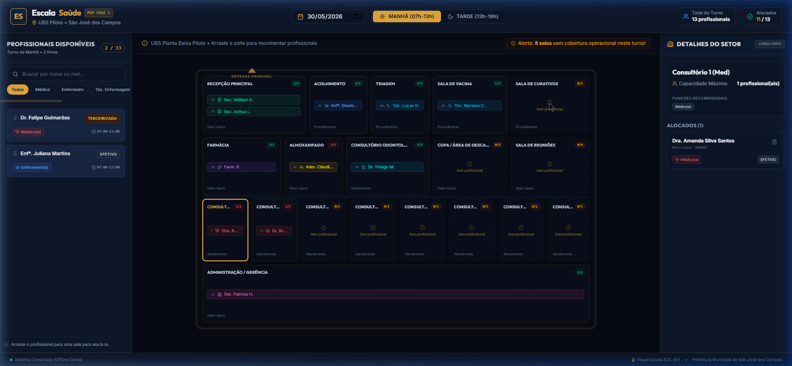
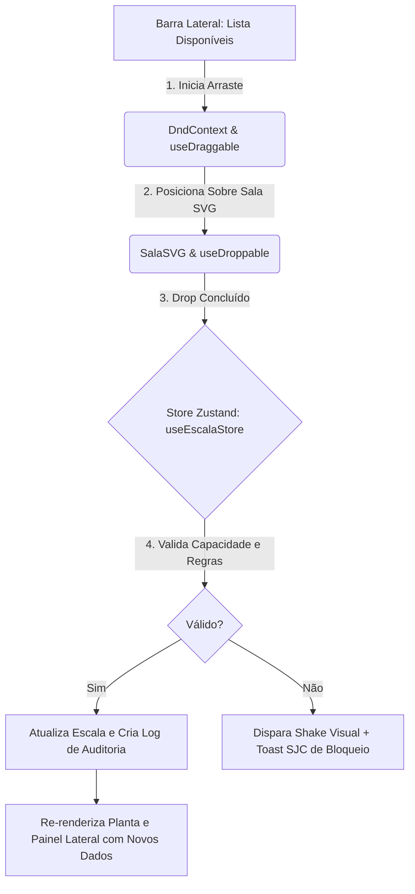

# 🏥 EscalaSaúde — UBS Piloto (SJC) 🇧🇷

<div align="center">
  
  
  <h3>Painel de Escala Visual de Alta Performance para Unidades de Saúde</h3>
  
  <p align="center">
    Substituindo planilhas manuais por um painel tático interativo baseado na planta baixa real e regras operacionais em tempo real.
  </p>

  <p align="center">
    
    
    
    
    
    
  </p>
</div>

---

## 🌟 Vitrine do Sistema

Abaixo está o registro visual do painel tático operacional da UBS Piloto, desenvolvido sob a identidade oficial da **Prefeitura Municipal de São José dos Campos (Azul Escuro, Ouro Metálico e Prata)**:

```
+-----------------------------------------------------------------------------------------+
| [ES] EscalaSaúde (MVP)                 [30/05/2026] [MANHÃ]      Turno: 13 | Alocados: 11 |
+-----------------------------------------------------------------------------------------+
| PROFISSIONAIS DISPONÍVEIS |              PLANTA BAIXA DA UBS              | DETALHES DA SALA    |
|                           |  +-----------------------------------------+  |                     |
| [DR. FELIPE] (MED)  [v]   |  | RECEPÇÃO (2/3)      |  CURATIVOS (0/2)   |  | Consultório 1       |
|                           |  | - Rec. William A.   |  (Sem profissional)|  | - Cap: 1/1          |
| [ENFª JULIANA]      [v]   |  | - Rec. Arthur L.    |                    |  | - Ideal: Médico     |
|                           |  +---------------------+--------------------+  |                     |
|                           |  | FARMÁCIA (1/2)      |  CONS. ODONTO (1/2)|  | Alocados:           |
|                           |  | - Farm. Regina R.   |  - Dr. Thiago M.   |  | - Dra. Amanda S.    |
|                           |  +---------------------+--------------------+  |                     |
|                           |  |         8 CONSULTÓRIOS DE ATENDIMENTO    |  | [Limpar Turno]      |
|                           |  |  [C1: 1/1] [C2: 1/1] [C3: 0/1] [C4: 0/1] |  | [Carregar Base]     |
|                           |  +-----------------------------------------+  |                     |
|                           |  | ADM / GERÊNCIA (1/2) - Ger. Patrícia H.  |  | HISTÓRICO LOGS      |
|                           |  +-----------------------------------------+  | - Movido Amanda S.  |
+-----------------------------------------------------------------------------------------+
```

### 📸 Screenshot de Alta Resolução



---

## 🚀 Diferenciais do EscalaSaúde

*   **Visão Tática Espacial (SVG Croqui)**: O usuário não preenche tabelas cegas. Ele distribui os profissionais visualmente nas salas reais de atendimento (como Recepção Principal, Acolhimento, Consultórios e Procedimentos).
*   **Identidade Visual SJC**: Interface premium estilizada no tema de São José dos Campos (Blau, Ouro e Prata) com transparências em *glassmorphism* e estética tática militar/operacional.
*   **Cores Por Função**: Identificação imediata da cobertura operacional através de crachás coloridos por profissão (Médicos em vermelho, Enfermeiros em azul, Recepção em verde, etc.).
*   **Validações Operacionais**:
    *   **Restrições de Capacidade**: Trava física que impede de alocar mais profissionais do que o limite da sala (ex: consultório individual restrito a 1 médico).
    *   **Alertas de Adequação**: Alerta visual se um profissional for alocado em uma função/sala inadequada (ex: Recepcionista na sala de Triagem).
    *   **Alertas de Cobertura**: Indicador reativo exibindo quantas salas estão desguarnecidas operacionalmente no turno.
*   **Histórico de Auditoria Reativo**: Log reativo na lateral direita que grava cada alteração de escala na sessão para controle de auditoria.

---

## 📐 Arquitetura Simplificada do Sistema

Abaixo está o fluxo lógico de distribuição de dados e eventos durante uma ação de alocação de profissionais (Drag & Drop):



---

## 🛠️ Tecnologias Utilizadas

*   **Core**: [React 18](https://reactjs.org/) + [TypeScript](https://www.typescriptlang.org/) (Segurança de tipagem ponta a ponta).
*   **Styling**: [Tailwind CSS v4](https://tailwindcss.com/) (Altamente otimizado + Directives @theme).
*   **Drag & Drop**: [@dnd-kit/core](https://dnd-kit.com/) (Altamente responsivo, suporte a sensores de clique e toque).
*   **State Management**: [Zustand](https://github.com/pmndrs/zustand) (Armazenamento reativo global leve de alta performance).
*   **Icons**: [Lucide React](https://lucide.dev/) (Conjunto de vetores limpos).
*   **Bundler**: [Vite](https://vitejs.dev/) (Builds de produção ultra velozes).

---

## 🏃 Como Rodar o Projeto Localmente

Certifique-se de possuir o [Node.js](https://nodejs.org/) instalado em sua máquina.

1.  **Clone o Repositório**:
    ```bash
    git clone https://github.com/maia-andre/mvp-escalasaude.git
    cd mvp-escalasaude
    ```

2.  **Instale as Dependências**:
    ```bash
    npm install
    ```

3.  **Inicie o Servidor de Desenvolvimento**:
    ```bash
    npm run dev
    ```

4.  **Acesse no Navegador**:
    ```bash
    http://localhost:3000/
    ```

---

## 📄 Licença

Desenvolvido para fins de validação de conceito e prototipagem da UBS Piloto municipal. Prefeitura de São José dos Campos.